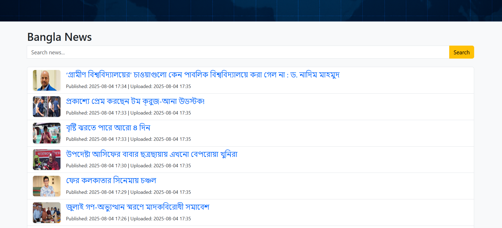

# 24HoursNewsHub

A Flask-based web application that scrapes and displays news articles from top news websites and updated every hour. The UI is built with HTML, CSS, and Bootstrap 5 for a modern, responsive experience.

## Features
- Scrapes news from multiple sources (Bangla & English)
- Categories: National, World News, Sports, Science & Technology, Others
- Pagination (20 articles per page)
- Search bar with fuzzy matching for news titles
- News items include title, published date, source URL, upload date, and image
- Navigation bar for categories
- Hero section with background image and business name
- Footer with social media and portfolio links
- "About this site" section


## 🚩 Demo

### [Live Website](https://two4hoursnewshub.onrender.com)





## Tech Stack
- Python 3
- Flask
- SQLite
- BeautifulSoup, curl_cffi (for scraping)
- Bootstrap 5, Bootstrap Icons

## Setup & Usage
1. **Clone the repository**
   ```bash
   git clone <your-repo-url>
   cd 24HoursNewsHub
   ```
2. **Install dependencies**
   ```bash
   pip install -r requirements.txt
   ```
3. **Scrape news and populate the database**
   ```bash
   python news_scraper.py
   ```
4. **Run the Flask app**
   ```bash
   python app.py
   ```
5. **Open your browser**
   Visit [http://127.0.0.1:5000](http://127.0.0.1:5000)

## Customization
- Update `news_scraper.py` to add more sources or categories.
- Edit `templates/index.html` and `static/css/style.css` for UI changes.
- Update footer links in `index.html` for your own social/portfolio URLs.

## 📜 License
This project is licensed under the **MIT License** – see the [LICENSE](LICENSE) file for details.

## 🛠️ Contributions
Contributions are welcome! Feel free to fork the repo and submit a pull request.

## 📩 Contact
For any inquiries or collaborations:
- **Portfolio:** [mominur.dev](https://mominur.dev)
- **GitHub:** [github.com/mominurr](https://github.com/mominurr)
- **LinkedIn:** [linkedin.com/in/mominur--rahman](https://www.linkedin.com/in/mominur--rahman/)
- **Email:** mominurr518@gmail.com

🚀 **Star this repo** ⭐ if you find it useful!
